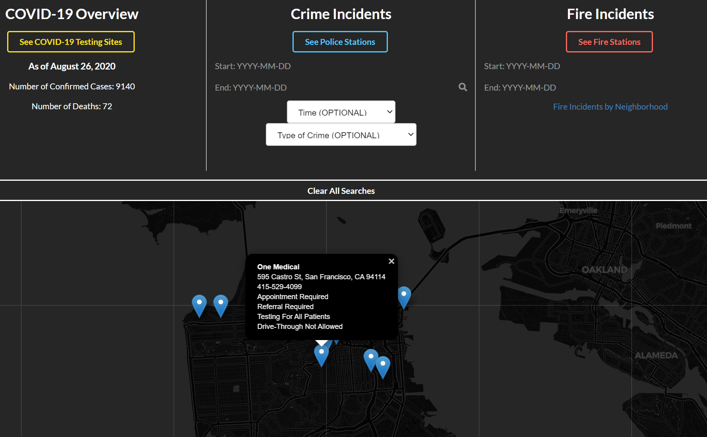
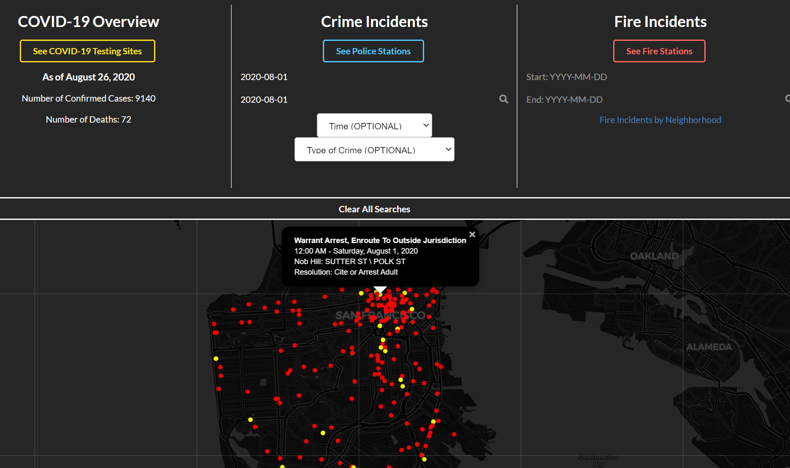
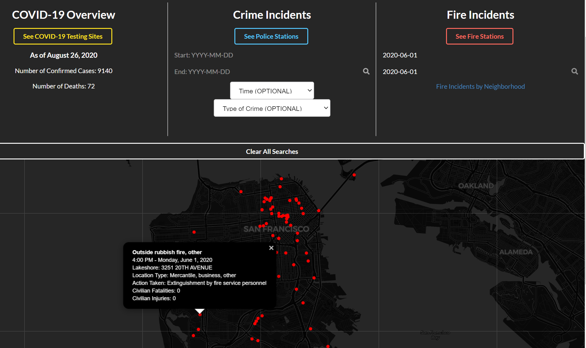
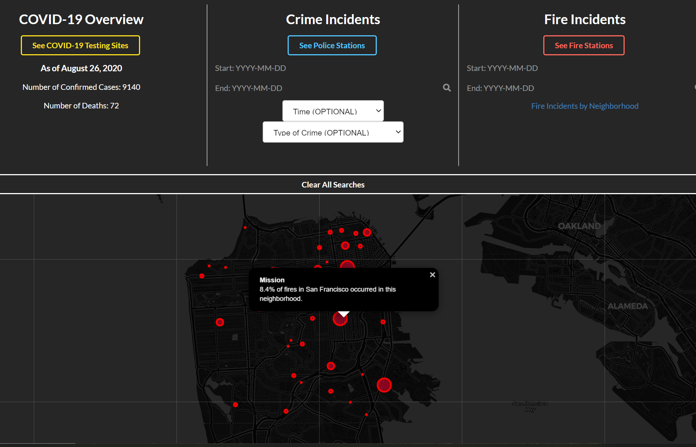

div align="center">

# SF Watch

Built with HTML, Semantic UI, jQuery, SOCRATA API, and Leaflet Javascript Library

URL of the deployed application: https://rpdurk.github.io/SFWatch/

URL of the GitHub repository: https://github.com/rpdurk/SFWatch/

## Table of Contents 

* [Description](#description)
* [View](#view)
* [Usage](#usage)
* [Built With](#built-with)
* [Credits](#credits)
* [License](#license)

## Description

>Ever day community members, public service members, government officials, or individuals looking to move into a community might want to understand rates of police, fire, and other medical incidents like COVID-19, as well as corresponding resources that deal with each. Third-party APIs in conjunction with visual javascript library, can allow this information to be visualized to better sever members of the community.

This app runs in the browser and features dynamically updated html and CSS. Our team used  [SOCRATA API](https://dev.socrata.com/) to obtain data pertaining to police and fire incidents in San Francisco and the [Leaflet Open-source JavaScript Library](https://leafletjs.com/) to help visualize the data. 

This application is for anyone interested in information pertaining to San Francisco.  It could be especially useful for community members, key city stakeholders, researchers, etc.

## View

To view the website, you can click [here](https://github.com/rpdurk/SFWatch/).

## Usage and Key Features

In this application, the user can find data regarding COVID-19 cases, Police Incidents, and Fire Incidents within the city of San Francisco:

* Location of Testing sites as of 8-26-2020
* COVID-19 Confirmed Cases
* COVID-19 related Deaths
* Police Station Locations
* Police Incidents Search using specific date or date range
* Police incidents can be filtered by 3 specific time windows, or 25 types of crime incidents
* Fire Station Locations
* Fire Station Search using specific date or date range
* Actual Fire Incidents based on neighborhoods in San Francisco

If the user is interested in location of COVID-19 Testing sites, police stations or fire stations, click the button and a pin will show the corresponding location and pertinent information (e.g. address, phone number, etc.). 

Under "Crime Incidents" input a date or date range you are interested in searching, then click the search icon. Police incidents will be displayed as different dots.  If you click on a dot, you will see relevant information filed about the incident.

If you are interested in looking at incidents based on a set of times or a specific type of incident, you can filter your search using the drop downs.

If a user wants to see relevant fire Incidents put in a date or date range you are interested in.  The incidents will display on screen similarly to the police incidents.  The relevant information will also be shown once clicked on.

Not all calls to a fire station are specifically for fires, so if a user just wants to understand which areas in the city have had more fires, click "Fire Incidents by Neighborhood" and you will see a display that will show how many actual fires were in any given neighborhood.

This webpage is also mobile responsive, and can be used on smaller screens.

## Built With

* [HTML](https://html.spec.whatwg.org/) - Markup language used to define the structure of webpage.
* [Sematinc UI](https://semantic-ui.com/) - Development framework that helps create responsive layouts using human-friendly HTML.
* [jQuery](https://jquery.com/) - JavaScript library that simplifies HTML client-side scripting. Used in this application to access APIs and dynamically create and update HTML elements.
* [SOCRATA API](https://dev.socrata.com/) - API that allows you to access open data resources from governments, non-profits, and NGOs around the world.
* [AQI API](https://aqicn.org/api/) - Air Quality Programmatic APIs that allow users to access over 1000 city level data points. 
* [Leafletjs](https://leafletjs.com/) - An open-source JavaScript library for mobile-friendly interactive maps.

## License 

MIT License Copyright (c) 2020 Jeremy Bouchard, Ryan Durk, Ian Panlilio, and Alisa Poon

